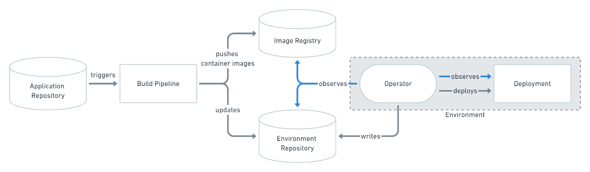
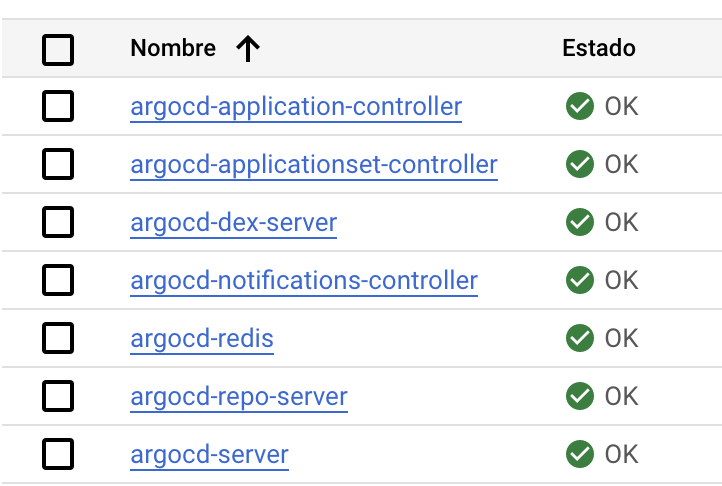

# T3chfest GitOps Infra

En este repositorio podrás encontrar código para desplegar una infraestructura de Kubernetes en GCP, un ArgoCD para el despliegue y control de las aplicaciones y una configuración de ejemplo para el despliegue de un servidor web de tipo Nginx.

## Componentes

En el siguiente diagrama se especifica la arquitectura de la solución:



Como se puede apreciar, se van a desplegar los siguientes componentes:

- Kubernetes
- ArgoCD
- Nginx

## Cómo empezar

A continuación se detallarán todos los pasos necesarios para desplegar la infraestructura descrita anteriormente.

### Prerequisitos

Para poder hacer el despliegue es necesario contar con:

- GCP: usuario con acceso a la consola y cliente de gcloud instalado en local.
- Kubernetes: cliente de Kubectl instalado para interactuar con el clúster de Kubernetes.
- Python: lenguaje de programación que utilizaremos para inicializar los componentes.

## Instalación

### Descarga de Software

Como primer paso, es necesario clonar el repositorio:

```console
git clone https://github.com/aggcastro/t3chfest-gitops-infra.git
```

### Despliegue de k8s

Para poder desplegar la infra, lo primero que habría que hacer sería modificar el fichero "terraform/terraform.tfvars" donde se indican el id del proyecto y la región donde se va a desplegar el clúster.

```console
project_id = "<Proyecto>"
region     = "<Region>"
```

Una vez establecidos los valores, se puede ejecutar el script de despliegue:

```console
python3 init-k8s.py
```

## Despliegue de ArgoCD

Para poder desplegar el ArgoCD dentro del clúster de Kubernetes, basta con ejecutar el siguiente script:

```console
python3 init-argocd.py
```

### Revisión del estado del despliegue

Para comprobar el estado del despligue, se puede revisar que todos los componentes se han desplegado correctamente e interactuar con ellos:

```console
kubectl get pods -n argocd
```

Una vez desplegado, obtendremos algo parecido a esto en el clúster de Kubernetes:



### Acceso al Nginx

Para acceder al servidor web desde nuestro navegador, una vez que hemos configurado la aplicación en ArgoCD, ejecutaremos el siguiente comando:

```console
kubectl port-forward deployment/my-nginx 8090:80
```

## Acceso al GUI de ArgoCD

En primer lugar necesitamos ejecutar el siguiente comando en la consola local:

```console
kubectl port-forward svc/argocd-server -n argocd 8080:443
```

A continuación, accedemos al ArgoCD en nuestro navegador a través de la siguiente URL:

```console
https://localhost:8080
```

Para acceder utilizaremos el usuario "admin" y como contraseña utilizaremos el valor que aparece al final del despliegue del ArgoCD, justo debajo del mensaje terminado en "rolled out".

### Borrado de la infrastructura

Una vez terminado, se puede eliminar la infraestructura al completo accediendo a la carpeta de terraform y ejecutando el siguiente comando:

```console
terraform destroy
```

## Estructura del repositorio

- [app](app): scripts utilizados para el despliegue de los componentes de la aplicación en Kubernetes.
- [images](images): imágenes que se han utilizado en este Readme para la documentación.
- [terraform](terraform): scripts de terraform que se han utilizado para desplegar el clúster de Kubernetes.

## Documentación de referencia

- [Terraform](https://registry.terraform.io/providers/hashicorp/google/latest/docs/guides/using_gke_with_terraform)
- [ArgoCD](https://argo-cd.readthedocs.io/en/stable/)
